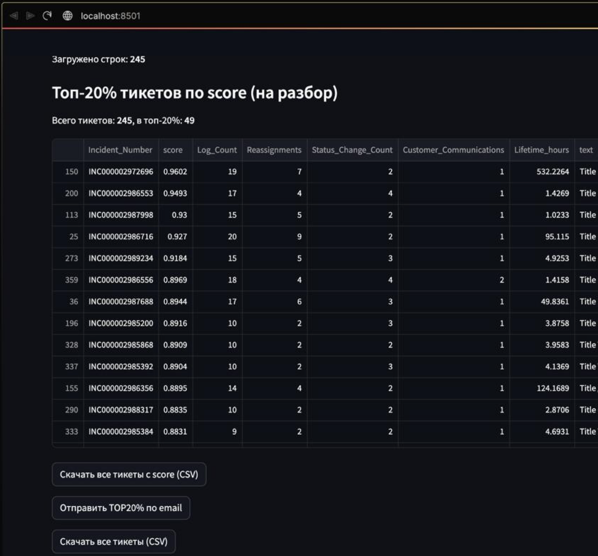
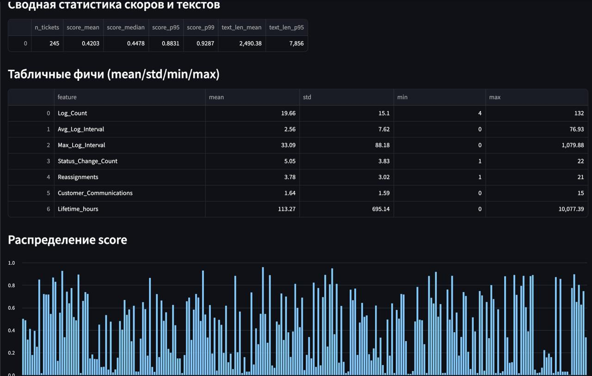

# SD Experts Incident Ranking System

## 1. Summary

Система регулярного автоматического выявления и ранжирования аномальных («плохих») инцидентов в потоке Service Desk (SD Experts). Решение заменяет ручной мониторинг тысяч заявок на автоматизированный скоринг, позволяя выделять проблемные кейсы с точностью, превышающей случайную выборку в **4.7 раза** (Lift@20%).
Работа в условиях экстремального дисбаланса классов (**1:1000**), где стандартные методы классификации неэффективны.
## 2. Постановка задачи и данные

### 2.1. Проблема

Входящий поток заявок составляет ~244,000 тикетов. Из них подтвержденно проблемных всего 281.

**Соотношение:** ~1:1000 (0.1%).
**Цель:** Не просто классифицировать (0/1), а **ранжировать** поток заявок так, чтобы наверху списка оказывались наиболее вероятные кандидаты на эскалацию.

### 2.2. Источники данных

**СУБД:** Remedy
**Объекты:** Worklogs, Title, Notes.

### 2.3. Feature Engineering

Были выделены две группы признаков:

**Табличные (Метаданные):**
- `Lifetime_hours`: Время жизни заявки.
- `Reassignments`: Количество переназначений (пинг-понг).
- `Log_Count` & `Avg_Log_Interval`: Плотность коммуникации.
- `Customer_Communications`: Количество ответов пользователю.
**Текстовые:**
- Конкатенация полей `Title` + `Notes` + `Worklog` + препроцессинг: удаление URL, email, нормализация пробелов.

## 3. Эволюция ML-решения (Modeling Journey)

В ходе разработки было протестировано 5 гипотез. Этот путь обусловлен сложностью работы с дисбалансом.

### Гипотеза 1: Классический ML (Baseline)

- **Модель:** CatBoostClassifier на табличных признаках.
- **Результат:** F2 ~0.69, ROC-AUC ~0.84.
- **Проблема:** Игнорирует контекст переписки (текст).

### Гипотеза 2: End-to-End Deep Learning

- **Модель:** Fine-tuning `sberbank-ai/ruRoberta-large` (SequenceClassification).
- **Результат:** Провал. Модель коллапсировала в мажоритарный класс (всегда предсказывала "0") из-за дисбаланса 1:1000. Oversampling не помог.

### Гипотеза 3: CatBoost + CLS(1024)

- **Архитектура:** BERT Embeddings + CatBoost для табличных данных, конкатенация, Classification Head.
- **Результат:** F2 ~0.71, AUC ~0.7.

### Гипотеза 4: Hybrid Approach (Late Fusion)

- **Архитектура:** Замороженный BERT (Mean Pooling) + MLP для табличных данных, конкатенация и MLP уменьшение размерности, Classification Head.
- **Результат:** F1 ~0.45, AUC ~0.9

### Гипотеза 5: Two-Stage Stacking

Было решено разделить обработку текста и метаданных.

**Этап 1 (NLP):**
- **MLM (Masked Language Modeling):** Дообучение `ruRoberta-large` на корпусе тикетов, чтобы модель понимала специфический SD-жаргон.
- **Feature Extraction:** Обучение легковесной классификационной головы на эмбеддингах RuRoberta.
- **Output:** Вероятность (`p_bad_text`) подается как _признак_ на следующий этап.

**Этап 2 (Ranking):**
- **Модель:** CatBoostClassifier.
- **Input:** Табличные признаки + `p_bad_text`.

## 4. От Классификации к Ранжированию

Использовать жесткий порог (threshold) для бинарной классификации при дисбалансе 1:1000 оказалось непрактично — слишком много False Positives.

Был совершен переход к парадигме Learning to Rank: модель выдает скор (вероятность), по которому тикеты сортируются.

Метрика успеха — Lift@k:

Показывает, во сколько раз модель эффективнее случайного поиска.

```
Random baseline - 0.129%
Lift@k = Precision@k / Random baseline (эффективность модели)

recall@1% 	(2/56≈4%) 	Precision@1%  	0.46%   Lift@1%   	3.6x    
recall@2% 	(2/56≈4%) 	Precision@2%  	0.23%   Lift@2%   	1.8x    
recall@10%  (33/56≈59%) Precision@10%   0.76%   Lift@10%    5.9x    
recall@20%  (53/56≈95%) Precision@20%   0.61%   Lift@20%    4.7x 
```
## 5. Инфраструктура и Deployment

**Docker & Cross-Platform Build**

Разработка велась на macOS (Apple Silicon), деплой — на Linux/Windows (x86_64).

Для обеспечения совместимости использовался docker buildx и строгая фиксация версий.

**Windows Task Scheduler & Auth**

Скрипт запускается на Windows Server в корпоративном домене.

**Проблема:** Ошибка `0x80070520` (A specified logon session does not exist) при запуске задачи без активной сессии пользователя.

**Решение:**
Настройка локальных политик (`secpol.msc`): _Network access: Do not allow storage of passwords and credentials -> Disabled_.
Права на _Log on as a batch job_.

**Email Reporting:** Использован PowerShell wrapper внутри Python (`subprocess`) для отправки писем через корпоративный SMTP с использованием нативной Windows-аутентификации.

Использован подход **Dev Containers**. Полное окружение разработки живет внутри Docker-контейнера. 
# Установка и запуск сервиса

Для запуска нужно клонировать
```bash
git clone https://github.com/asphalter95/Incidents_project.git
cd ./INCIDENTS
docker build -t incidents_project .
docker run -p 8501:8501 incidents_project
```
Затем перейти по адресу http://localhost:8501

## 6. Мониторинг и отчетность

Система генерирует еженедельный отчет, содержащий:
**TOP-20% Suspicious:** Список самых приоритетных инцидентов для ручного разбора.
**Data Drift Stats:** Мониторинг распределения скоров (Median, p95, p99) и длины текстов, чтобы отслеживать изменения в распределении данных.
**Visualization:** Streamlit-дашборд для интерактивного анализа метрик.



